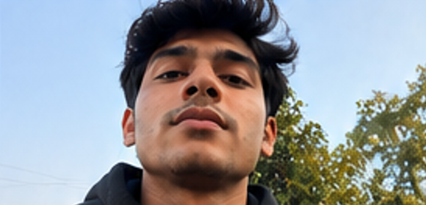
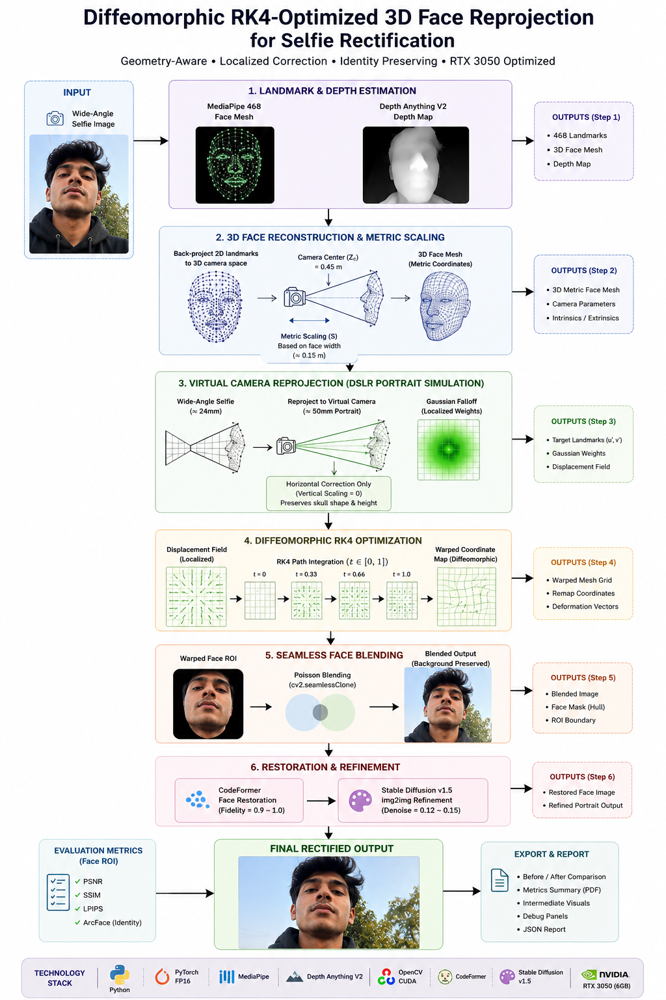

# SelfieRectification

A geometry-aware selfie perspective rectification and face restoration pipeline. This project corrects wide-angle selfie distortion while preserving identity and background realism.

---

## 📸 Sample Output

| Original Selfie | Rectified Result |
|:---:|:---:|
|  |  |

| Diagnostic Visualization |
|:---:|
|  |

---

## ✅ What this project provides

- Selfie perspective correction using face mesh geometry
- RK4-style smooth coordinate remapping for depth-aware warping
- Seamless Poisson blending to preserve background and edges
- Face restoration using CodeFormer
- Final refinement using Stable Diffusion img2img

---

## 🔬 How It Works (Technical Architecture)

Close-up smartphone selfies suffer from **perspective distortion** (radial barrel distortion and relative scaling changes where the nose appears disproportionately larger than the cheeks and ears). Rather than using generic 2D homographies or global affine transformations (which warp the background and stretch the skull), this pipeline models physical 3D camera projection locally:

```
                  [Input Wide-Angle Selfie]
                             ↓
[MediaPipe]        Reconstruct 468-point 3D face mesh landmarks
                             ↓
[Camera Math]      Back-project 2D pixels to camera space metric coordinates
                             ↓
[Optimizer]        Remap coordinate fields using diffeomorphic RK4 path integration
                             ↓
[Poisson Blend]    Blend face back into 100% original background via cv2.seamlessClone
                             ↓
[CodeFormer]       Restore face texture details, skin, and eyes (GPU)
                             ↓
[Diffusion img2img] Denoise & refine skin realism with low-strength SD v1.5 (GPU FP16)
                             ↓
                 [Rectified Final Output Image]
```

## 🛠 Installation

### Windows
```powershell
cd SelfieRectification
python -m venv .venv
.\.venv\Scripts\Activate.ps1
python -m pip install --upgrade pip
python -m pip install -r requirements.txt
```

### macOS
```bash
cd SelfieRectification
python3 -m venv .venv
source .venv/bin/activate
python3 -m pip install --upgrade pip
python3 -m pip install torch torchvision torchaudio
python3 -m pip install -r requirements-mac.txt
```

> For Apple Silicon, install the correct PyTorch wheel from https://pytorch.org before installing the remaining requirements.

---

## ▶️ Run the app

### Web UI
#### Windows
```powershell
cd SelfieRectification
.\.venv\Scripts\Activate.ps1
.\launch.bat
```
Open `http://127.0.0.1:7860`

#### macOS
```bash
cd SelfieRectification
source .venv/bin/activate
python -m scripts.gradio_app
```

### Command line
```bash
cd SelfieRectification
source .venv/bin/activate    # or .\.venv\Scripts\Activate.ps1 on Windows
python -m scripts.main datasets/input_sample.jpg
```

---

## 🧪 Verify install

```bash
python -m scripts.verify_setup
python -m scripts.test_gpu
```

---

## 📁 Expected outputs

The pipeline writes results to `outputs/<timestamp>/`.
Common files include:
- `landmarks.png`
- `depth.png`
- `rectified.png`
- `final.png`
- `outputs/reports/*.html`

Sample files already included:
- `datasets/input_sample.jpg`
- `datasets/output_rectified.png`
- `datasets/debug_vis.png`

---

## 🧹 Repository cleanup guidance

Exclude generated runtime folders from Git:
- `.venv/`
- `cache/`
- `checkpoints/`
- `outputs/`
- `repos/`
- Large `datasets/` folders

The top-level `.gitignore` already excludes these items for `SelfieRectification`.

---

## 🌐 Publish to GitHub

### First push
```bash
cd SelfieRectification
git init
git add .
git commit -m "Add Windows/macOS setup instructions and sample outputs"
git branch -M main
git remote add origin https://github.com/<username>/<repo>.git
git push -u origin main
```

### Subsequent updates
```bash
git add README.md INSTALL.md requirements-mac.txt
git commit -m "Update documentation and cleanup repo"
git push
```

---

## 📌 Notes

- Use `requirements.txt` for Windows/CUDA installs.
- Use `requirements-mac.txt` for macOS CPU/MPS installs.
- `launch.bat` creates local Hugging Face caches at `cache/huggingface`.
- The Web UI is good for quick testing; the CLI is best for scripted runs.
